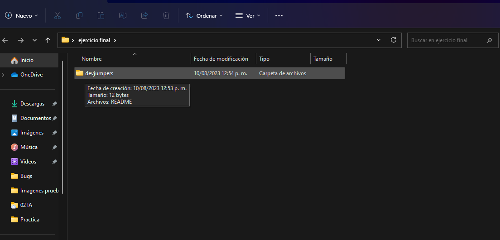
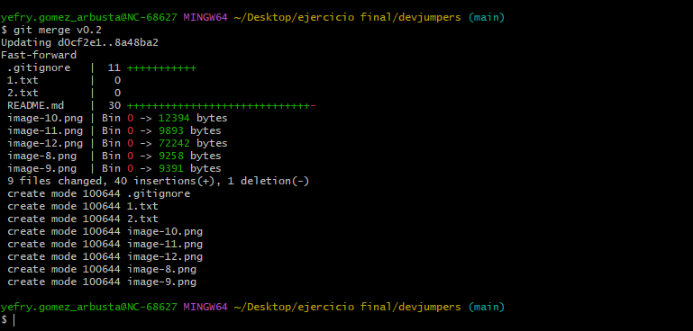
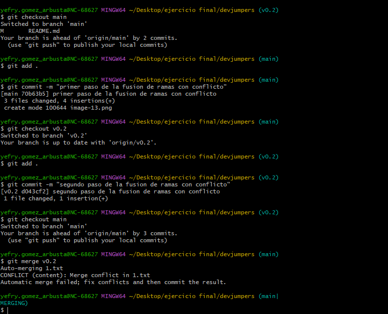
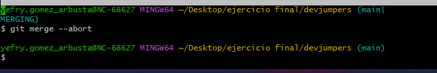
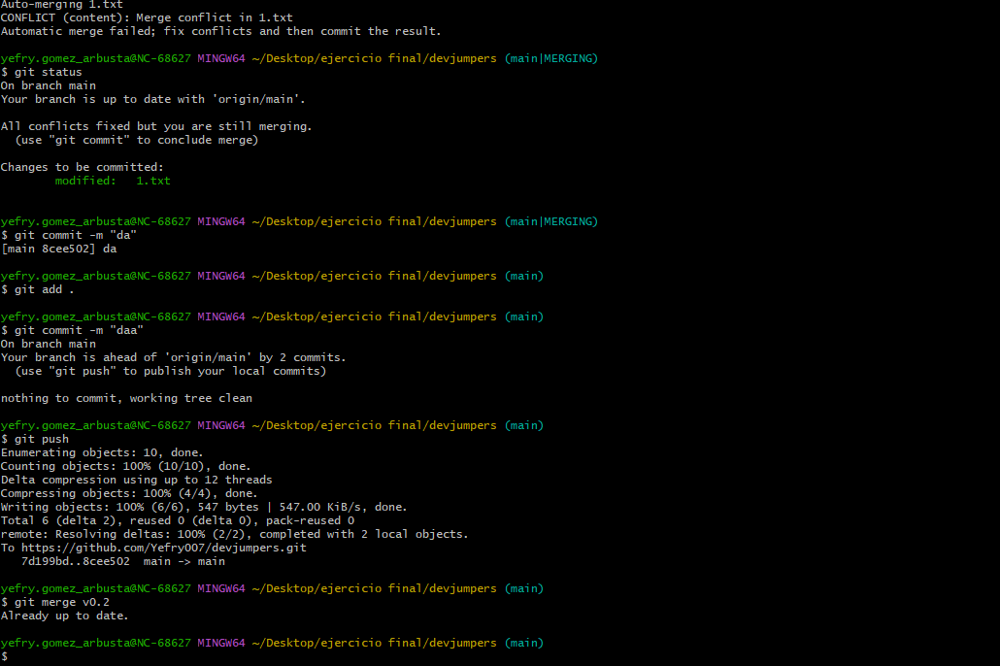
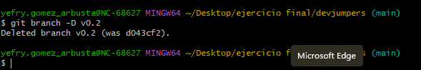
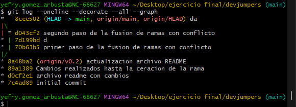

# devjumpers

Se clona el repositoria con el comando git clone [link del repositorio]

Se realiza un "git add ."

Se realiza un commit con el comando "git commit -m ["descripcion del commit"]"

Se realiza un push con el comando "git push"

se crea un archivo .gitignore 

En el archivo de .gitignore se escriben los nombres de los archivo que se desean ignorar 

Se crea un nuevo fichero llamado privado con el comando "touch privado"

Se crea una carpeta llamada privada con el comando "mkdir privada"

Se agregan tanto la carpeta y el archivo al .gitignore
Se crea un nuevo fichero llamado 1.txt con el comando "touch 1.txt"

Se crea una rama con el nombre v0.2 con el comando "git branch v0.2"

Se cambia de rama 

Se añade el fichero 2.txt a la rama v0.2 con el comando "touch 2.txt"

Se suben los cambios hechos hasta el momento

Se fusiona la rama v0.2 con la main utilizando el comando "git merge v0.2", Se debe estar en la rama main para realizar esto

Se realiza una fusion de ramas con un merge en conflicto 

Se cancela el merge con el comando "git merge --abort"

Se soluciona el errorn del merge, al hacer commit en ambas ramas, subir los cambios y fusionar

Se borra la rama v0.2, con el comando "git branch -d v0.2"

listar los cambios 
